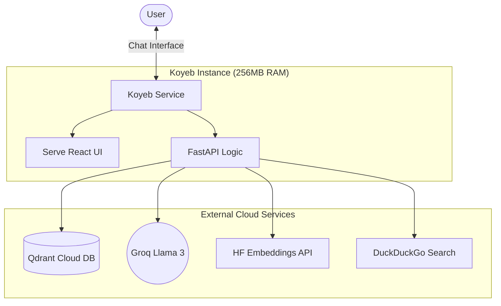

# 🌍 AI Trip Agent - Cloud Deployment Guide

An advanced, intelligent travel assistant that combines **Vector Knowledge (RAG)** and **Web Search** to provide comprehensive travel plans. This project is specifically configured for high-performance **Cloud Deployment**.

## 🚀 Key Features (Cloud Optimized)
*   **Zero-RAM Embeddings**: Uses **Hugging Face Inference API** for embeddings, allowing the app to run on the **Koyeb Nano Free Tier (256MB RAM)**.
*   **Fast Reasoning**: Powered by **Groq (Llama 3)** for near-instant responses.
*   **Global Knowledge Base**: Connects to **Qdrant Cloud** for persistent, scalable vector storage.
*   **Integrated UI**: The React/Vite frontend is built into the backend, allowing a single-service deployment.

## 🏗️ Cloud Architecture



## 🛠️ Tech Stack
*   **Host**: Koyeb (Nano GPU instance)
*   **LLM**: Groq (Llama 3-70b/8b)
*   **Vector DB**: Qdrant Cloud
*   **Frontend**: React + TypeScript (Pre-built)

## 🛠️ Cloud Environment Setup
Add these variables in your **Koyeb Service Settings**:
```env
QDRANT_URL=https://your-cluster-url.cloud.qdrant.io
QDRANT_API_KEY=your-api-key
GROQ_API_KEY=your-groq-key
HF_TOKEN=your-huggingface-read-token
```

## ☁️ Deployment Workflow

### 1. Build the Frontend Locally
Since Koyeb does not have Node.js and Python on the same small instance, you build the UI on your computer first:
```powershell
cd frontend
npm install
npm run build
cd ..
```

### 2. Push to GitHub
```powershell
git add .
git commit -m "Build: Prepare for cloud deployment"
git push
```

### 3. Populating your Cloud Database
Once Koyeb says **"Healthy"**, send your local travel JSON files to the cloud:
1. Update `KOYEB_URL` in `send_data.py`.
2. Run: `python send_data.py`
3. Verify: Check your site!

## 🧪 Live Endpoints
*   **Web Interface**: `https://your-app-name.koyeb.app/`
*   **API Documentation**: `https://your-app-name.koyeb.app/docs`
*   **API Info**: `https://your-app-name.koyeb.app/api/v1/info`
*   **Health Check**: `https://your-app-name.koyeb.app/health`

## 🧠 Core Agentic Logic
The system uses `OrchestrateAgent` to coordinate:
1.  **Metadata Extraction**: `AdditionalInfoAgent` scans RAG for hidden details (rules, durations).
2.  **Context Synthesis**: `TravelResearchAgent` merges RAG data and Web search results into a professional Markdown itinerary.
