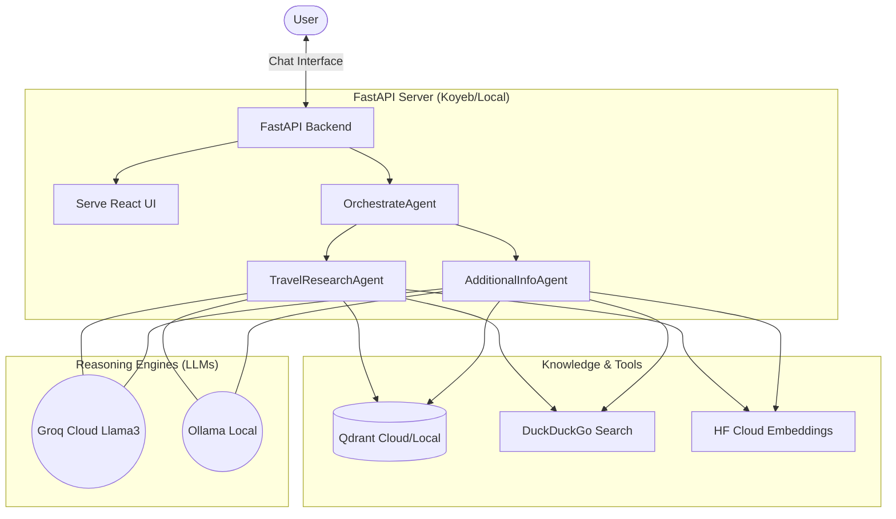

# 🌍 AI Trip Agent (Hybrid Cloud/Local)

An advanced, intelligent travel assistant that combines **Vector Knowledge (RAG)** and **Web Search** to provide comprehensive travel plans. This project is optimized for both **Local Inference** and **Cloud Deployment (Koyeb)**.

## 🚀 Key Features
*   **Hybrid Intelligence**:
    *   **Cloud Mode**: Uses **Groq (Llama 3)** for speed and **Hugging Face** for cloud-based embeddings (0 RAM usage).
    *   **Local Mode**: Runs entirely offline with **Ollama** and local vector storage.
*   **RAG (Retrieval-Augmented Generation)**: Uses **Qdrant** (Cloud or Local) to search curated datasets first for high-quality, trusted info.
*   **Modern Interactive UI**: Professional React chat interface, now served directly from the FastAPI backend.
*   **Multi-Agent System**:
    *   `OrchestrateAgent`: High-level coordinator that manages agent flow.
    *   `AdditionalInfoAgent`: Specialized in deep-dive metadata extraction.
    *   `TravelResearchAgent`: Synthesizes data into a cohesive travel response.

## 🏗️ High Level Architecture



## 🧠 AI & Agentic Concepts

1.  **Hybrid RAG Store**:
    *   The app automatically detects if `QDRANT_URL` is present. If so, it connects to **Qdrant Cloud**; otherwise, it uses a local folder on your disk.
2.  **Memory-Optimized Embeddings**:
    *   Uses **Hugging Face Inference API** for embeddings. This allows the app to run on the **Koyeb Nano Tier (256MB RAM)** by offloading the heavy math to the cloud.
3.  **Strict Relevance Guard**:
    *   Agents check search results for keyword matches and similarity scores. If the local data isn't good enough, they automatically pivot to **Web Search**.

## 🛠️ Tech Stack
*   **Backend**: Python, FastAPI, Uvicorn (serving both API and Static files).
*   **Frontend**: React, TypeScript, Vite, TailwindCSS (Pre-built in `frontend/dist`).
*   **Vector DB**: Qdrant (Cloud or Local).
*   **LLMs**: Groq (Cloud), Ollama (Local).

## 🛠️ Environment Setup
Create a `.env` file in the root directory:
```env
# --- CLOUD CONFIG (Required for Koyeb) ---
QDRANT_URL=https://your-cluster-url.cloud.qdrant.io
QDRANT_API_KEY=your-api-key
GROQ_API_KEY=your-groq-key
HF_TOKEN=your-huggingface-token  # For Cloud Embeddings

# --- LOCAL CONFIG (Optional) ---
# If these are missing, it defaults to local Ollama and local storage
```

## 🏃‍♂️ How to Run Locally

### 1. Prerequisites
*   **Python**: Use a Virtual Environment (`python -m venv venv`).
*   **Ollama**: Install and run `ollama pull llama3`.

### 2. Setup & Start
```powershell
# 1. Activate venv
.\venv\Scripts\activate

# 2. Install dependencies
pip install -r requirements.txt

# 3. Start the app
python api.py
```
*   **Access the App**: [http://localhost:8000](http://localhost:8000)

## ☁️ Cloud Deployment (Koyeb)

1.  **Push to GitHub**: Ensure the `frontend/dist` folder is included in your push.
2.  **Deploy on Koyeb**: Connect your repository to a new Koyeb Service.
3.  **Add Environment Variables**: Add `QDRANT_URL`, `QDRANT_API_KEY`, `GROQ_API_KEY`, and `HF_TOKEN` in the Koyeb dashboard.
4.  **Health Check**: Wait for the "Healthy" status.

### 🚀 Data Migration to Cloud
If your Cloud Qdrant is empty, run the migrator script:
```powershell
python send_data.py
```
*(This sends your local JSON dataset to your live Koyeb API, which re-indexes them into the Cloud Vector DB).*

## 🧪 API Endpoints
*   **Chat UI**: Root `/`
*   **API Docs**: `/docs`
*   **Direct Query**: `/api/v1/final-response?query=London`
*   **Health**: `/health`
